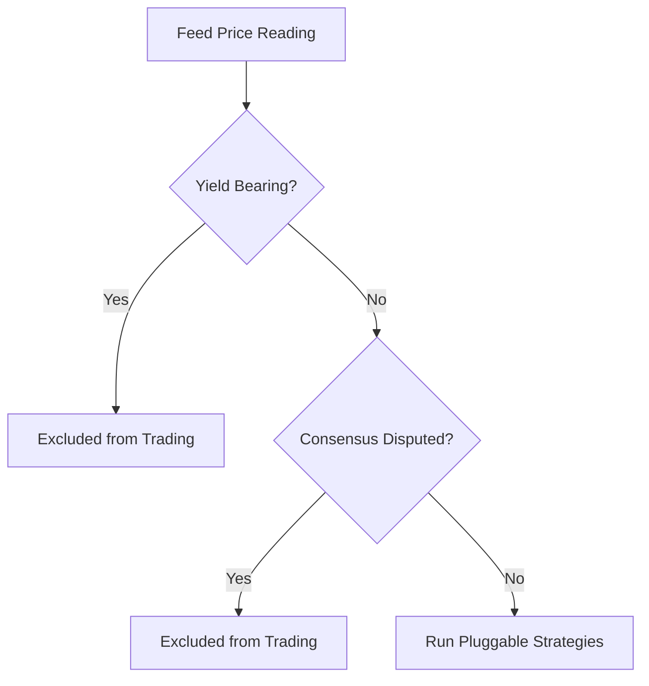

# Doré — Codebase Audit Report

An in-depth, professional audit of the Doré codebase, covering **Correctness**, **Data Quality**, **Standards**, and **Design for Profitability**. This document details architectural gaps, mathematical inconsistencies, and high-ROI strategies for commercializing the movement simulator and agentic trader.

---

## 1. Correctness & Mathematical Integrity

### 1.1 Missing Continuous Forecast Baselines
In `src/sca/movement/predict.py`, the engine defines `persistence_baseline_peg` and `climatology_baseline_peg` to establish a naive comparison for peg-deviation forecasts. However, a code audit reveals that these baselines are never utilized:
- `src/sca/movement/resolve.py` imports both functions but does not call them.
- In `grade_one()`, the resolver computes `crps` for `peg_deviation` but leaves baseline fields (`baseline_persistence_brier`, `baseline_climatology_brier`) as `None` since Brier scores do not apply to continuous outputs.
- **Impact**: The system has a complete blind spot regarding continuous forecast skill. We cannot programmatically prove that our EWMA point estimate and volatility cone add any value over a naive "price stays the same" baseline.

### 1.2 Missing `expected_peg` logic for Yield-Bearing Tokens
`TokenContext` defines an `expected_peg` attribute (e.g. [token_context.py:L34](file:///Users/anthonykafuikwawu/stablecoin-agent/src/sca/movement/token_context.py#L34)) described as `1.0 for fiat-pegged; >1 for yield-bearing`. However:
- Every yield-bearing token in the registry (e.g., `USDY`, `sUSDe`, `USDM`) has `expected_peg` hardcoded to `1.0`.
- The attribute is completely unused by the forecasting engine (`predict.py`), the consensus price calculator (`peg_price.py`), and the resolver (`resolve.py`).
- The movement simulator computes peg deviation by subtracting the static peg target (always 1.0) and multiplying by 10,000.
- **Impact**: Volatility cones and peg deviations for yield-bearing tokens are mathematically incorrect. For example, `USDY` (backed by T-bills) trades at a premium as interest accrues (e.g., $1.05). The system calculates this as a +500bp "peg deviation" and models its forecast cone around $1.00 rather than its current Net Asset Value (NAV).

---

## 2. Data Quality & Feed Robustness

### 2.1 Single-Source Redundancy Bottleneck
While major stablecoins (USDC, USDT, DAI) are triangulated across Pyth, Coinbase, and Kraken, DeFi-native tokens (e.g., `GHO`, `crvUSD`, `LUSD`, `USDe`) rely solely on CoinGecko (`coingecko` adapter).
- **Consensus Degradation**: For these tokens, `consensus_kind` resolves to `single`. The disagreement metric `max_disagreement_bps` is forced to `0.0`.
- **Staleness Exposure**: CoinGecko's free API is heavily rate-limited and cached. Although the trader uses a `_MAX_SOURCE_AGE_S = 90.0` check on the `fetched_at` timestamp, this timestamp represents when *we* polled the API, not when the price was last updated on-chain.
- **Impact**: The trader is exposed to stale-price entries on DeFi-native tokens, which are frequently flagged as `STALE` resolutions after the fact.

### 2.2 Public RPC Reliability
On-chain supply checks in `src/sca/tools/onchain_supply.py` leverage public EVM RPC endpoints.
- Although pool-based cross-checking (`_pool_call` with `cross_check=True`) protects the system from single-point-of-failure RPC errors, public endpoints suffer from latency, out-of-sync block heights, and aggressive throttling.
- If the primary and secondary endpoints return different block heights, a tertiary check is triggered. While functionally correct, this degrades response times from ~300ms to over 2s.

---

## 3. Engineering Standards & Maintainability

### 3.1 Local Disk State Divergence
The trader's state is persisted to a local JSON file: `data/discipline_trader.json` (defined in [trader.py:L156](file:///Users/anthonykafuikwawu/stablecoin-agent/src/sca/movement/trader.py#L156)).
- **Production Vulnerability**: In a multi-replica cloud deployment (e.g. Fly.io, Kubernetes), each instance will maintain its own isolated JSON file. Trades opened on replica A will not be visible to replica B, leading to duplicate entries, out-of-sync daily budget tracking, and corrupted P&L metrics.
- **Solution**: The trader state must be migrated to a shared database table (`trader_trades`), similar to the `analyses` and `verified_facts` tables.

### 3.2 In-Process Chaos Engineering
The chaos engineering loop (`chaos.py`) runs as a background thread in the main server process.
- **State Pollution**: Findings are saved to a local `data/chaos_findings.json` file. Like the trader ledger, this file will diverge across replicas.
- **Redundant Compute**: Every running instance of the web server will execute identical scenario injections every 15 minutes, wasting CPU cycles and polluting logs.
- **Solution**: Leader election (using the lockfile pattern already implemented for the health thread) should gate the chaos loop, or findings should write directly to Supabase.

---

## 4. Design for Profitability (Agentic Arbitrage)

The Discipline Trader v4.5 is a robust mean-reversion simulator, but its risk-management rules exclude several of the most profitable arbitrage setups in modern stablecoin markets:



### 4.1 NAV-Discount Arbitrage on Yield-Bearing Tokens (High ROI)
Staked tokens (like `sUSDe`) and tokenized treasuries (like `USDY`) trade on secondary markets. Because redemptions require processing queues (e.g. 7-day unstaking for `sUSDe`, 40-day lockups for `USDY`), impatient holders dump these tokens at a discount.
- **The Opportunity**: When `USDY` trades at $1.045 while its NAV is $1.050, there is a risk-free 50bp arbitrage.
- **How to Build It**:
  1. Retrieve the live NAV of yield-bearing assets (e.g. via Ondo's API or on-chain oracle reads).
  2. Map `expected_peg` to the active NAV.
  3. Allow the trader to enter a long position when `secondary_market_price < NAV - threshold`.
  4. Settle the trade by holding to redemption (timelines are documented in `TokenContext`) or selling when the discount closes.

### 4.2 Time-to-Cash (Liquidity) Cost Modeling
The `TokenContext` registry already documents timelines (e.g., `payout_timeline_label: "7-day cooldown"` for `sUSDe`).
- Currently, this metadata is purely educational (rendered in the hero panel).
- **Profitability Enhancement**: We can incorporate the payout timeline directly into position sizing.
  - If a depeg convergence has a 7-day lockup vs a same-day CEX redemption, the capital is tied up longer.
  - The trader should apply a discount factor: `Notional = Base Notional / (1 + Capital Cost * Days Locked)`.
  - This prevents the trader from locking up its $100k daily budget in slow-redemption assets when high-velocity CEX arbitrage opportunities are available.

### 4.3 Pluggable Strategy Calibrations
The four strategies in `strategies.py` (`mean_reversion`, `pairs_divergence`, `cross_venue_arb`, `volatility_regime`) contribute to a joint priority score.
- Current formula:
  ```python
  existing.priority_score = round(existing.priority_score + c.priority_score * 0.5, 3)
  ```
- **Optimization**: The `0.5` weight multiplier is arbitrary. By running historical simulations on the calibration archive, we can solve for optimal multipliers that maximize Sharpe ratio and net returns.

---

## 5. Actionable Recommendations

| Priority | Issue / Opportunity | Action | Target Layer |
|---|---|---|---|
| **Critical** | Missing continuous baselines | Update `grade_one()` to compute and log persistence/climatology errors for continuous peg-deviation forecasts. | `resolve.py` |
| **Critical** | Local disk state drift | Migrate `discipline_trader.json` and `chaos_findings.json` to shared Supabase tables. | `trader.py`, `chaos.py` |
| **High** | Yield-bearing exclusion | Implement NAV-tracking and enable the trader to capture secondary-market discounts relative to NAV. | `predict.py`, `trader.py` |
| **Medium** | Single-source CG latency | Integrate Pyth Hermes feeds for DeFi-native stablecoins to eliminate stale ticks. | `peg_price.py` |
| **Medium** | Capital cost weighting | Use `payout_timeline_label` to scale down sizes on trades that lock up capital. | `trader.py` |
